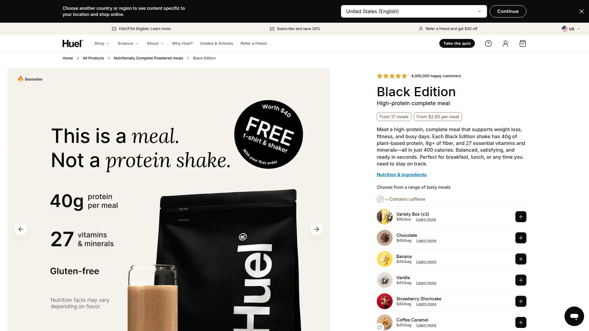
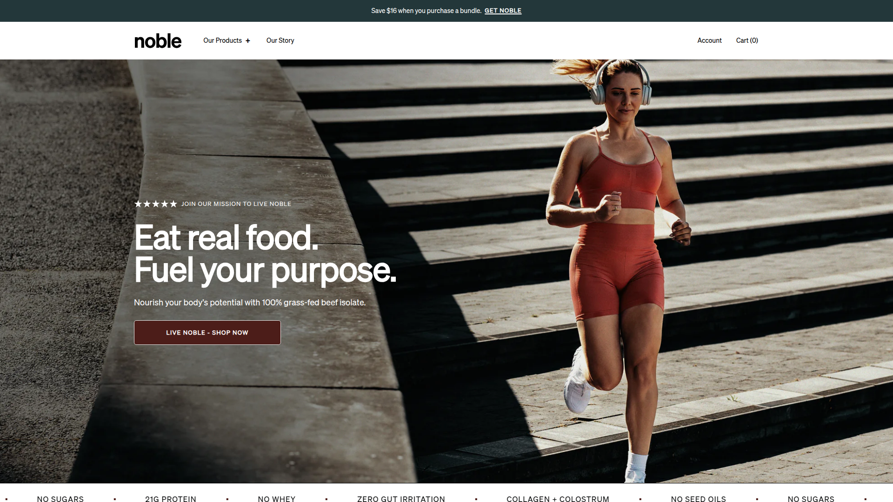
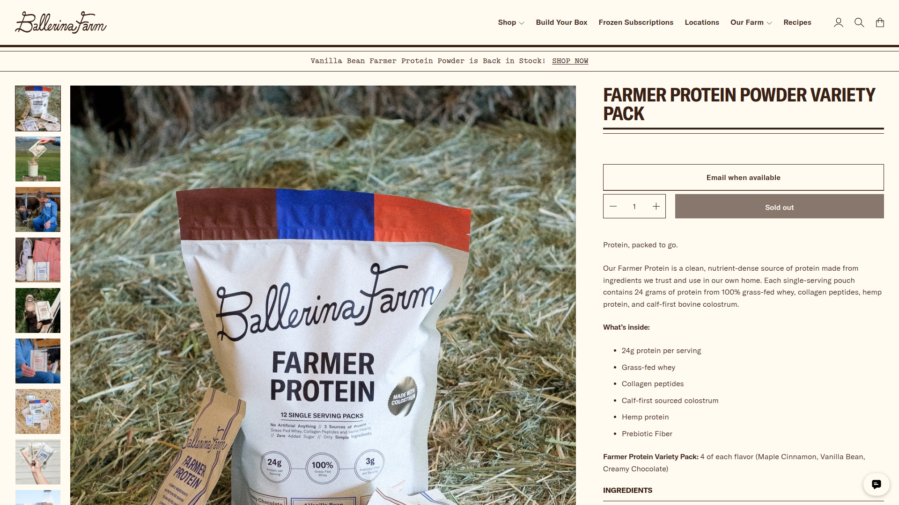

# Product Detail Page (PDP) Competitor Analysis & Recommendations

## Executive Summary

This document provides a comprehensive analysis of competitor product detail pages in the protein powder and nutritional supplement space, with specific recommendations for Nimble Daily's PDP strategy.

## Competitor Analysis Overview

### Analyzed Competitors:
1. **Ballerina Farm** - Farmer Protein ([Link](https://ballerinafarm.com/products/farmer-protein-powder-variety-pack))
2. **Equip Foods** - Prime Protein Beef Isolate ([Link](https://www.equipfoods.com/products/prime-protein-beef-isolate-protein))
3. **Ka'Chava** - Chocolate Superblend ([Link](https://www.kachava.com/products/shakes/chocolate))
4. **Ritual** - Essential Protein Daily Shake ([Link](https://ritual.com/products/essential-protein-daily-shake-18))
5. **OWYN** - Protein Shakes ([Link](https://liveowyn.com/products/protein-shakes/?sku=8839))
6. **Huel** - Black Edition ([Link](https://huel.com/products/huel-black-edition))
7. **Aloha** - Chocolate Protein Powder ([Link](https://aloha.com/products/chocolate-protein-powder))
8. **Noble Origins** - All-in-One Protein ([Link](https://nobleorigins.com/))

### Competitor Screenshots Captured
**✅ Successfully captured screenshots for all 8 competitors using Firecrawl API**

Screenshots are saved in `docs/screenshots/` folder:
- **Ballerina Farm**: `ballerinafarm_screenshot.png`
- **Equip Foods**: `equipfoods_screenshot.png`
- **Ka'Chava**: `kachava_screenshot.png`
- **Ritual**: `ritual_screenshot.png`
- **OWYN**: `owyn_screenshot.png`
- **Huel**: `huel_screenshot.png`
- **Aloha**: `aloha_screenshot.png`
- **Noble Origins**: `nobleorigins_screenshot.png`

---

## Screenshot Analysis

### 1. Equip Foods - Prime Protein

**Key Observations:**
- **Clean, minimal design** with focus on product image
- **9 flavor options** prominently displayed with visual swatches
- **Clear pricing**: $63.99 with subscription toggle
- **Strong social proof**: 6,433 reviews with 4.9/5 rating
- **Simple value prop**: "21g of bioavailable, complete protein"
- **Three key ingredients** highlighted: beef, cocoa, stevia

### 2. Ka'Chava - Chocolate Superblend

**Key Observations:**
- **Visual-heavy design** with 5 flavor variants
- **Subscription pricing**: $69.95 → $59.95 (clear savings)
- **"85+ superfoods"** messaging prominently featured
- **Comprehensive certifications**: Vegan, gluten-free, non-GMO
- **Educational approach** with ingredient transparency
- **Free gift offer** with first order

### 3. Huel - Black Edition

**Key Observations:**
- **Value-focused messaging**: "$2.65 per meal"
- **Strong subscription model**: 20% discount highlighted
- **Scientific credibility**: "40g protein + 27 vitamins"
- **Complete meal positioning** vs. just protein
- **"4,000,000 happy customers"** social proof
- **Multiple delivery intervals** for flexibility

### 4. Noble Origins - All-in-One

**Key Observations:**
- **Premium positioning**: Higher price point ($142)
- **"Nose-to-tail nutrition"** unique selling proposition
- **Mission-driven branding** with founder story
- **"Real food" messaging** vs. processed alternatives
- **21g grass-fed beef protein** prominently featured
- **Bundle options** for increased AOV

### 5. OWYN - Protein Shakes

**Key Observations:**
- **"Only What You Need"** philosophy clearly communicated
- **Allergen-free focus**: "Zero major allergens"
- **20g plant-based protein** with clean positioning
- **Dietitian recommended** credibility marker
- **3,462 reviews** for social proof
- **Comprehensive FAQ section** for education

### 6. Aloha - Chocolate Protein

**Key Observations:**
- **Clean, organic positioning** with earth tones
- **"Real cacao, 4g sugar"** health-conscious messaging
- **Flexible subscription**: 1-3 month options
- **USDA Organic certification** prominently displayed
- **Recipe integration** showing versatility
- **Strong visual hierarchy** with clear CTAs

### 7. Ritual - Essential Protein

**Key Observations:**
- **Premium, clinical design** with white/mint color scheme
- **"Traceable ingredients"** transparency focus
- **Plant-based positioning** with pea protein
- **"Hand-crafted vanilla"** premium messaging
- **Scientific approach** with ingredient sourcing
- **Clean, minimal buy box** design

### 8. Ballerina Farm - Farmer Protein

**Key Observations:**
- **Rustic, authentic branding** with farm imagery
- **24g protein** from multiple sources (whey, collagen, hemp)
- **Single-serving pouches** for convenience
- **"Calf-first bovine colostrum"** unique ingredient
- **Variety pack** approach for trial
- **Farm-to-table positioning** with lifestyle branding

---

## Key PDP Sections Analysis

### 1. Hero Section & Buy Box

**Common Elements:**
- Product image gallery (3-5 images minimum)
- Clear product name and key benefit
- Pricing display with subscription options
- Flavor/variant selector
- Add to cart button
- Free shipping threshold

**Best Practices Observed:**

**Equip Foods:**
- 9 flavor options with visual swatches
- Clear $63.99 pricing
- Subscription toggle with 15% savings
- "Subscribe & Save" prominent positioning

**Ka'Chava:**
- 5 flavor variants with product images
- $69.95 one-time vs $59.95 subscription (14% discount)
- Free gift with first order
- Clear "Add to Cart" CTA

**Huel:**
- "$2.65 per meal" value positioning
- $56.30 one-time vs $45 subscription (20% discount)
- Multiple delivery interval options
- Starter kit offer

**Noble Origins:**
- Premium positioning at $142
- Bundle options available
- "30 servings per bag" clarity
- "21g Grass-Fed Beef Protein" headline

### 2. Product Benefits & Value Propositions

**Effective Messaging Strategies:**

**OWYN:**
- "Only What You Need" philosophy
- "20g plant-based protein"
- "Zero major allergens"
- "Superfood greens blend"

**Huel:**
- "40g plant-based protein + 27 vitamins & minerals"
- "100% nutritionally complete"
- "Supports weight loss, fitness, busy lifestyles"

**Noble Origins:**
- "Real food nutrition"
- "Nose-to-tail organ blend"
- "Zero gut irritation"
- "No whey or artificial ingredients"

### 3. Subscription & Pricing Models

**Common Discount Structures:**
- 10-22% subscription discounts
- Flexible delivery intervals (15, 30, 45, 60, 90 days)
- Easy subscription management
- Free shipping thresholds ($50-75)

**Pricing Strategies:**
- Equip Foods: $63.99 → $54.39 (15% off)
- Ka'Chava: $69.95 → $59.95 (14% off)
- Huel: $56.30 → $45.00 (20% off)
- Aloha: $32.99 with subscription options

### 4. Ingredients & Nutrition Transparency

**Best Practices:**
- Full ingredient lists with dosages
- Nutrition facts panels
- Third-party testing certificates
- "Free from" callouts (gluten, dairy, soy)
- Sourcing information (grass-fed, organic)

**Ka'Chava Excellence:**
- "85+ superfoods, nutrients, & plant-based ingredients"
- Comprehensive ingredient breakdown
- Multiple certifications displayed
- Educational content about ingredients

### 5. Social Proof & Testimonials

**Effective Social Proof Elements:**

**Equip Foods:**
- 6,433 reviews with 4.9/5 rating
- Detailed customer testimonials
- User-generated content

**OWYN:**
- 3,462 reviews
- Dietitian recommendations
- Media endorsements (GQ, Runner's World)

**Huel:**
- "4,000,000 happy customers"
- Expert endorsements
- Clinical study references

**Aloha:**
- 266 reviews with 4.8/5 rating
- Photo testimonials
- Clean review integration

### 6. Educational Content & FAQs

**Common FAQ Topics:**
- How to use/mix the product
- Timing recommendations
- Dietary restrictions
- Subscription management
- Return policies
- Ingredient explanations

**Best Practice Examples:**
- OWYN: Comprehensive allergen information
- Huel: Scientific backing for health claims
- Ka'Chava: Ingredient education

---

## Enhanced Recommendations Based on Screenshot Analysis

### Critical Success Patterns Identified:

**1. Subscription-First Approach**
- All competitors default to subscription pricing
- Savings clearly communicated (15-22% average)
- Multiple delivery intervals offered

**2. Protein Content Prominence**
- Protein amount (20-26g) featured in hero section
- Positioned as primary value proposition
- Used for direct competitive comparison

**3. Clean/Minimal Design Trends**
- White backgrounds with product focus
- Limited color palettes (2-3 colors max)
- Clear visual hierarchy and typography

**4. Social Proof Integration**
- Review counts prominently displayed
- Star ratings visible in hero section
- Customer testimonials with specific benefits

**5. Educational Content Strategy**
- Ingredient transparency and sourcing
- FAQ sections for common concerns
- Benefit-focused messaging over features

### Nimble Daily Competitive Positioning:

**Key Differentiators Identified:**
- **Highest protein content**: 26g vs 20-24g average
- **Only competitor with creatine**: 3g inclusion
- **Women-specific formulation**: Unique market positioning
- **4-in-1 formula**: Most comprehensive offering
- **Transparent dosing**: Full ingredient amounts listed

---

## Nimble Daily PDP Recommendation

### Hero Section Strategy (Updated Based on Screenshots)

**Headline:** "Nimble Daily: 4-in-1 Foundational Nutrition for Women"
**Subheadline:** "26g Protein + 3g Creatine + 10g Collagen + Essential Nutrients"

**Hero Layout (Following Best Practices):**
- **Left Side**: Product image with multiple angles
- **Right Side**: Buy box with subscription default
- **Color Scheme**: Clean white background with accent colors
- **Typography**: Bold, clear hierarchy similar to Huel/Ritual

**Key Benefits (Above the Fold):**
- ✓ **26g Grass-Fed Beef Protein** (highest in category)
- ✓ **Only Protein with 3g Creatine** (unique differentiator)
- ✓ **4-in-1 Formula** (protein + creatine + collagen + nutrients)
- ✓ **Women-Specific Nutrition** (targeted formulation)
- ✓ **No Fillers, Third-Party Tested** (clean positioning)

### Pricing Strategy

**Recommended Structure:**
- **One-time (15 servings):** $74.99
- **Subscribe & Save (15 servings):** $58.49 (22% OFF) ← **DEFAULT**
- **Subscribe & Save (30 servings):** $98.99 (34% OFF)

**Subscription Options:** 15, 30, 45, 60 days
**Free Shipping:** Orders $75+

### Content Sections (In Order)

1. **Hero + Buy Box**
2. **Social Proof Banner** (Third-party tested, GMP certified)
3. **Product Benefits Deep Dive**
   - Muscle Health & Energy
   - Joint & Mobility Support
   - Bone Health & Structure
4. **Nutrition Facts & Ingredients**
5. **Timeline & Results Expectations**
6. **Customer Testimonials**
7. **Expert Endorsement**
8. **Quality & Safety**
9. **FAQ Section**
10. **Usage Instructions**
11. **Trust Signals Footer**

### Differentiation Strategy (Screenshot-Informed)

**Unique Positioning Against Competitors:**

**vs. Equip Foods** (Simple beef protein):
- **Advantage**: 4-in-1 comprehensive formula vs. single ingredient
- **Positioning**: "More than just protein - complete nutrition"

**vs. Ka'Chava** (85+ superfoods):
- **Advantage**: Targeted women's nutrition vs. general superfood blend
- **Positioning**: "Precision nutrition for women's physiology"

**vs. Huel** (Complete meal):
- **Advantage**: Supplement positioning vs. meal replacement
- **Positioning**: "Perfect addition to your diet, not replacement"

**vs. Noble Origins** (Nose-to-tail):
- **Advantage**: Women-specific vs. general audience
- **Positioning**: "Designed for women's unique nutritional needs"

**vs. OWYN** (Allergen-free):
- **Advantage**: Performance-focused with creatine
- **Positioning**: "Not just clean - optimized for strength"

**Key Competitive Advantages:**
- **Only protein with creatine** (3g clinical dose)
- **Highest protein content** (26g vs 20-24g average)
- **Women-specific formulation** (unique market gap)
- **Transparent dosing** (full amounts listed)
- **Comprehensive formula** (protein + creatine + collagen + nutrients)

### Mobile Optimization

**Critical Elements:**
- Sticky buy box on mobile
- Touch-friendly flavor/size selector
- Collapsible benefit sections
- Quick add to cart flow
- Subscription toggle prominent

---

## Next Steps

1. **Implement hero section** with recommended messaging
2. **Set up subscription model** with 22% and 34% discounts
3. **Create benefit sections** highlighting 4-in-1 formula
4. **Develop social proof strategy** with testimonials
5. **Build FAQ section** addressing common concerns
6. **Test mobile experience** for conversion optimization

---

## Appendix: Competitive Intelligence

### Pricing Benchmark
- **Average one-time price:** $58.50
- **Average subscription discount:** 16.5%
- **Nimble Daily positioning:** Premium tier with superior value

### Key Differentiators by Competitor
- **Equip Foods:** Simple, clean beef protein
- **Ka'Chava:** Comprehensive superfood blend
- **Huel:** Complete meal replacement
- **Noble Origins:** Premium nose-to-tail nutrition
- **OWYN:** Allergen-free focus
- **Aloha:** Organic, clean ingredients

### Market Gaps Nimble Daily Can Fill
- Women-specific protein formulation
- Creatine inclusion for strength training
- Comprehensive collagen content
- Transparent dosing with no fillers

---

## Screenshot Collection Guide

### Manual Screenshot Process
Since the Firecrawl API is rate-limited, collect screenshots manually using these steps:

1. **Visit each competitor URL** (links provided above)
2. **Capture full-page screenshots** of the product detail pages
3. **Save with consistent naming**: `competitor_brand_section.png`
4. **Focus on these priority sections**:

### Screenshot Priorities by Competitor:

**Equip Foods** - Prime focus on:
- Hero section with 9 flavor options
- Subscription toggle (15% savings)
- 6,433 reviews display
- Ingredient transparency

**Ka'Chava** - Capture:
- 5 flavor variants with imagery
- "85+ superfoods" messaging
- Subscription pricing ($69.95 → $59.95)
- Comprehensive nutrition facts

**Huel** - Document:
- "$2.65 per meal" value prop
- 20% subscription discount
- "4,000,000 customers" social proof
- Scientific credibility section

**Noble Origins** - Screenshot:
- Premium $142 positioning
- "Nose-to-tail nutrition" messaging
- Founder story integration
- Quality certifications

**OWYN** - Focus on:
- "Only What You Need" philosophy
- Allergen-free messaging
- Dietitian endorsements
- FAQ section

**Aloha** - Capture:
- Clean, minimal design
- Organic/vegan positioning
- Review integration
- Subscription flexibility

### Screenshot Analysis Framework
For each screenshot, document:
- **Layout effectiveness**
- **Content hierarchy**
- **Visual design elements**
- **Conversion optimization tactics**
- **Mobile responsiveness**
- **Trust signals**